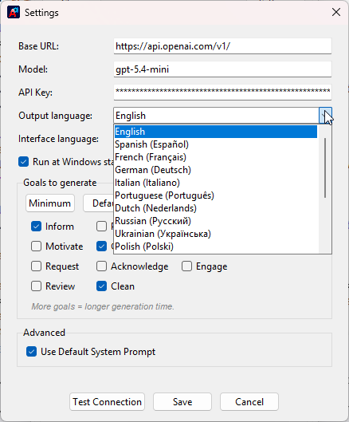
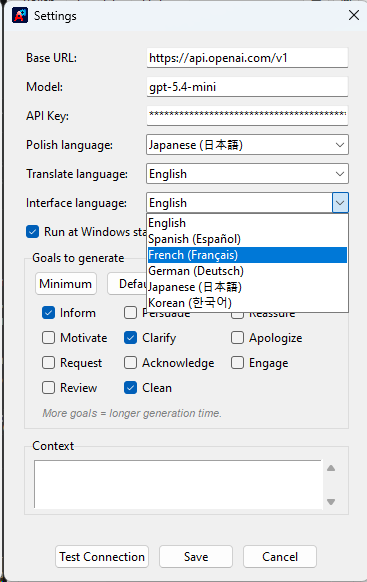
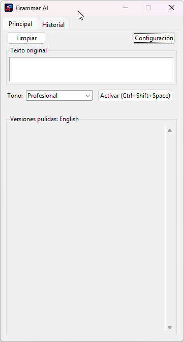
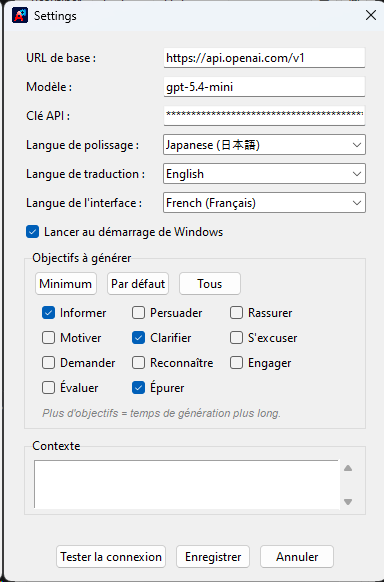

# Grammar AI

**A lightweight, FREE-forever desktop grammar corrector and text polisher.**

---

## Overview

**Grammar AI** is a lightweight desktop application built with Python for grammar correction and text polishing. Tired of premium grammar tools like Grammarly and LanguageTool? Enjoy **FREE FOREVER** grammar correction with the free tier of the [Groq](https://groq.com/) API key.

It has two core modes, each with its own tab and global hotkey: **Polish**, for rewriting text in a chosen tone and goal, and **Translate**, for quick, direct translation.

_Select text anywhere, press the hotkey, pick a polished version - done._

> 🎬 Prefer video? See [`media/how-to-use.mp4`](media/how-to-use.mp4) for the full walkthrough.

---

## ✍️ Polish

Rewrite text into one or more **tones**, each generated for several writing **goals** (inform, persuade, clarify, and more) at once.

1. In Settings, choose which **goals** to generate and optionally set a **context** to tailor output to your domain (see [Configuration](#configuration)).
2. Enter or paste text on the **Polish** tab, or select text anywhere and press `Ctrl+Shift+Space` to send it there directly. You can also use the **Trigger** button in the app.
3. Select a **tone** and review the generated polished versions.
4. Click **Use** next to the version you want, to paste it back where you copied it from.

Every polished result is saved to **History** for later reference.

### Cross-lingual polishing

Choose an **output language** in Settings and Grammar AI translates any source language into it before polishing.

_Pick from a curated list of output languages - or type any language the model understands._

- The model translates any source language into the selected output language before polishing.
- If you choose **English**, the app polishes text using American English conventions.
- If you choose another language, the app writes polished text naturally in that language.

---

## 🌐 Translate

Need a straight translation without a tone/goal rewrite? The **Translate** tab is a dedicated mode for that, separate from Polish.

1. Enter or paste text on the **Translate** tab, or select text anywhere and press `Ctrl+Alt+Space` to send it there directly.
2. Pick a **target language** from the dropdown - your choice is remembered independently of the Polish tab's output language.
3. Click **Translate** (or use the hotkey) to get the translated text, then **Copy** it to your clipboard.

Translations are not written to the History log; only Polish results are saved there.

---

## Localized Interface

The whole interface is localized, so you can use Grammar AI in your own language.

_Switch the interface language independently of the output language._

<table>
  <tr>
    <td align="center">
       
      <b>Español</b>
    </td>
    <td align="center">
       
      <b>Français</b>
    </td>
  </tr>
</table>

---

## Configuration

Grammar AI supports any LLM provider that is OpenAI-compatible, including OpenAI, Anthropic, Google, and more.

### Example Configuration ([Groq](https://groq.com/) Free Tier)

- **Base URL**: `https://api.groq.com/openai/v1/`
- **Model**: `openai/gpt-oss-120b`
- **API Key**: `YOUR_GROQ_API_KEY`

### Example Configuration (OpenAI)

- **Base URL**: `https://api.openai.com/v1`
- **Model**: `gpt-5.4-mini`
- **API Key**: `YOUR_OPENAI_API_KEY`

To configure:

1. Launch the application.
2. Open Settings and enter your API configuration.

---

## Installation

### Prebuilt Release (Windows)

**[⬇️ Download latest release →](https://github.com/vectorleap-pulse/grammar-ai/releases/latest)**

All releases: [github.com/vectorleap-pulse/grammar-ai/releases](https://github.com/vectorleap-pulse/grammar-ai/releases)

### From Source

1. Clone the repository.
2. Install dependencies: `uv sync`
3. Run: `uv run python main.py`

### Building from Source

To build a standalone executable:

1. Install dependencies including build tools: `uv sync --extra dev`
2. Run the build script:
   - Release build: `python build.py` or `build.bat`
   - Debug build (with console): `python build.py --debug` or `build.bat debug`
3. The executable will be created in the `build/grammar-ai/` folder.

---

## Tech Stack

- Python 3.12
- `tkinter` for UI
- `openai`-compatible AI integration
- `pystray` and `Pillow` for system tray
- `loguru` for logging
- `pydantic` for schema validation
- `ruff` and `mypy` for linting

---

## Storage

- Local SQLite database and log files are stored in `~/.grammar-ai/`.
- History entries include original text, polished text, tone, and timestamp.
- API keys are stored locally in the app database.

---

## Project Files

- `main.py` - application entry point
- `app/` - core application modules
- `pyproject.toml` - project metadata, dependencies, and linting configuration
- `build.py` - PyInstaller build script

---

## Support

If you found this helpful, please ⭐ **star this repository** and 👤 **follow me**!
