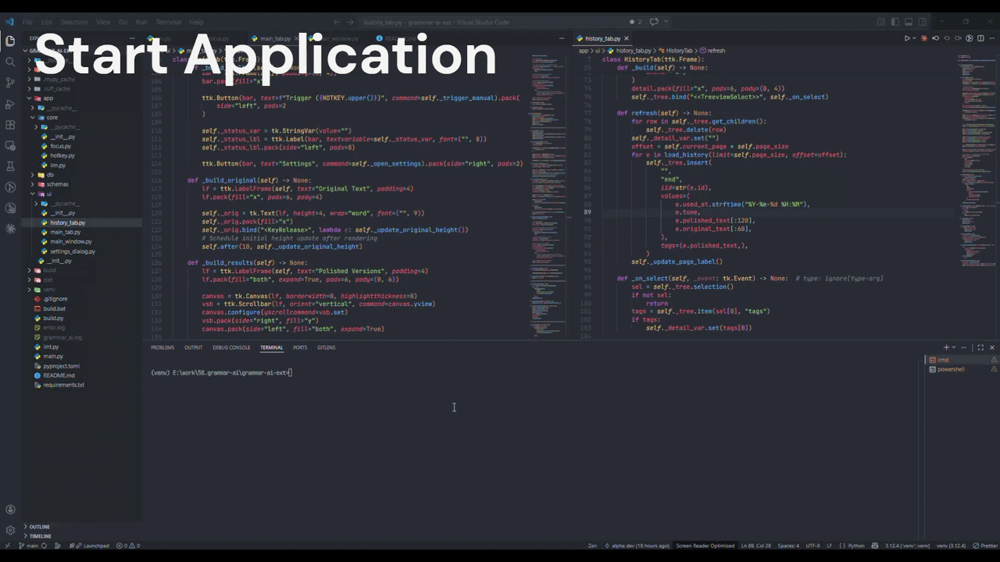

# GRAMMAR AI

## Overview

**GRAMMAR AI** is a lightweight desktop application built with Python for grammar correction and text polishing. Tired of premium grammar tools like Grammarly and LanguageTool? Enjoy **FREE FOREVER** grammar correction with the free tier of [Groq](https://groq.com/) API key. It provides a simple local UI for entering text, sending it to an AI service, and reviewing polished output.

---

## Usage

1. Launch the application.
2. Configure your API settings (see Configuration section above).
3. Enter or paste the text you want to polish.
4. Trigger text polishing by pressing `Ctrl+Shift+Space`.
5. Click the **USE** button for the polished version you want to use.

---

## Goals

* Provide fast grammar correction and writing-style polishing
* Offer multiple tone variations for output
* Keep the UI simple and easy to use
* Store history for future reference

---

## Tech Stack

* Python 3.12
* tkinter for UI
* `openai`-compatible AI integration
* `loguru` for logging
* `pydantic` for schema validation
* `ruff` and `mypy` for linting

---

## Configuration

GRAMMAR AI supports any LLM provider that is OpenAI-compatible, including OpenAI, Anthropic, Google, and more. You can use any platform, unlike some existing tools that are limited to specific platforms.

### Example Configuration ([Groq](https://groq.com/) Free Tier)

- **Base URL**: `https://api.groq.com/openai/v1/`
- **Model**: `meta-llama/llama-4-scout-17b-16e-instruct`
- **API Key**: `YOUR_GROQ_API_KEY`

To configure:
1. Launch the application.
2. Go to Settings and enter your API configuration.

---

## Installation

### Prebuilt Release (Windows)

Download the latest prebuilt executable for Windows from the [Releases](https://github.com/alpha5611331/grammar-ai/releases) page.

### From Source

1. Clone the repository.
2. Install dependencies: `pip install -r requirements.txt`
3. Run: `python main.py`

### Building from Source

To build a standalone executable:

1. Install dependencies: `pip install -r requirements.txt` (includes PyInstaller)
2. Run the build script:
   - For release build: `python build.py` or `build.bat`
   - For debug build (with console): `python build.py --debug` or `build.bat debug`
3. The executable will be created in the `dist/` folder.

---

## Usage

1. Launch the application.
2. Configure your API settings (see Configuration section above).
3. Enter or paste the text you want to polish.
4. Trigger text polishing by pressing `Ctrl+Shift+Space`.
5. Click the **USE** button for the polished version you want to use.

---

## Storage

* Local SQLite database stores configuration and history.
* History entries include original text, polished text, tone, and timestamp.

---

## Project Files

* `main.py` — application entry point
* `app/` — core application modules
* `requirements.txt` — runtime dependencies
* `pyproject.toml` — linting and type-checking configuration

---

## Notes

* API keys are stored locally in the app database.
* The project is designed for minimal setup and straightforward use.

---

## Support

If you found this helpful, please ⭐ star this repository and 👤 follow me!

---
